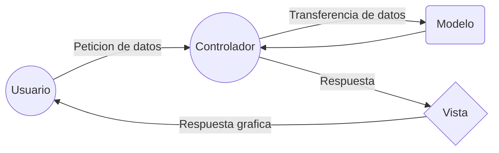

# Propuesta de arquitectura MMC

## Resumen

La arquitecutra MVC se utiliza para separar el codigo de distintas respnsabilidades que estos tienen **Es un patron de diseño**

Sus siglas coresponden a M (Model) V (Visual) y C (Controller)

## Model

Este componente se encarga de manipular, gestionar y actualizar los datos. Si se utiliza una base de datos aquí es donde se realizan las consultas, busquedas, filtros y actualizaciones.

## Vista

Este componente se encarga de mostrarle al usuario las pantallas, ventanas, paginas y formularios; el resultado de una solicitud. **A mi entender es lo que esta mas relacionado con el frontend**

## Controlador 

Este componente se encarga de gestionar las instrucciones que se reciben, atenderlas y procesarlas. Por medio de el se comunican el modelo y la vista: solicitando los datos necesarios; manipulandolos para obtener resultados y entregandolos a vista para que se pueda mostrar

