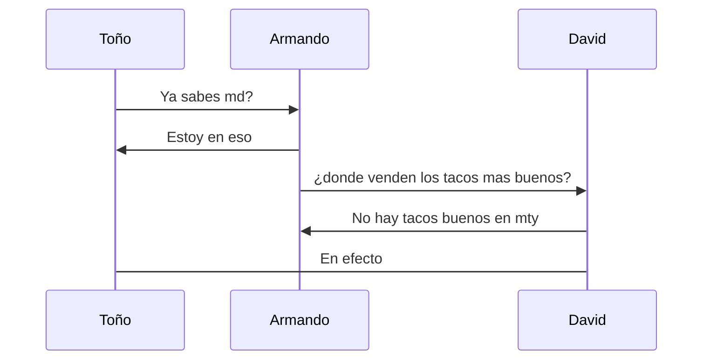

# La importancia de un codigo limpio 

se debe tener un codigo limpio para que pueda tener una escabilidad 
> *Nota:* de no tener un codigo ordenado y limpio se te puede aparecer el diablo

1. uno
2. dos
3. tres

- Tres
- Dos 
- uno

