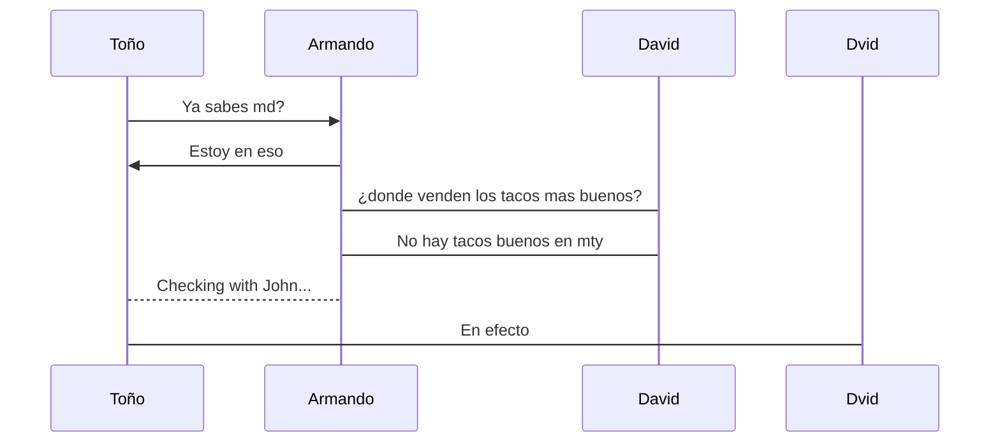

# La importancia de un codigo limpio 

se debe tener un codigo limpio para poder entender la organizacion de la misma

> *Nota:* se pueden tener resultados no deseados

```mermaid
sequenceDiagram
Toño ->> Armando: Ya sabes md?
Armando->>Toño: Estoy en eso
Armando-> David: ¿donde venden los tacos mas buenos?
David-> Armando: No hay tacos buenos en mty

Toño-->Armando: Checking with John...
Dvid->Toño: En efecto
```

